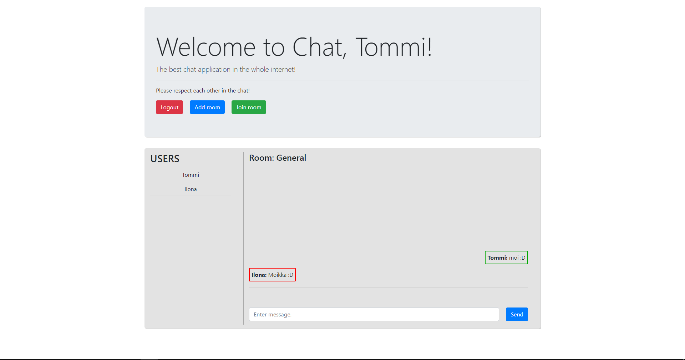
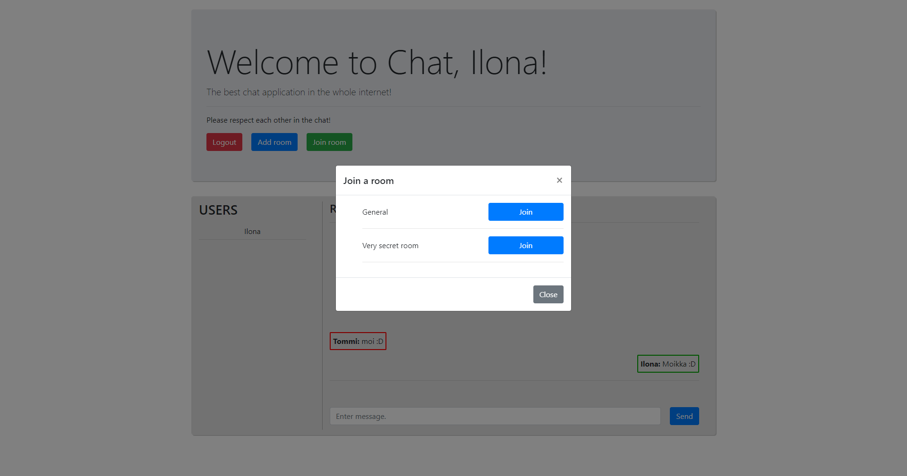
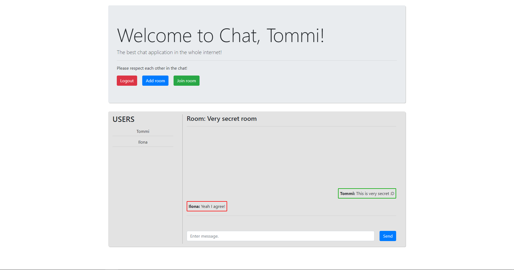

# Chat application

A full-stack Angular/Express chat application made as a school project.

  
  
  

## Technologies
### Frontend
- Angular, RxJS
- [@auth0/angular-jwt](https://www.npmjs.com/package/@auth0/angular-jwt)
  - Provides HttpInterceptor to attach JSON Web Token to all HttpClient requests
- [NgRx](https://ngrx.io/)
  - State management

### Backend
- Node.js, [Express](https://expressjs.com/), TypeScript
- MySQL for deployment, SQLite for development
- [Passport](https://www.passportjs.org/)
  - Provides functionality for JWT authentication
- [Sequelize](https://sequelize.org/)
  - Provides ORM for the database
- [Socket.io](https://socket.io/)
  - Provides easy API for WebSocket connection, rooms etc.
